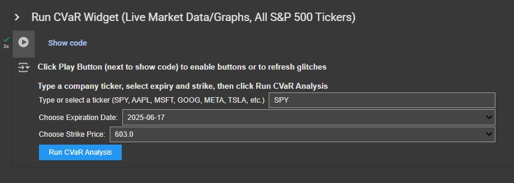

# Aaishah's Projects 🚀 🌍 
> Hi! My name is Aaishah, and I am from San Jose, Bay Area. I am currently an undergrad attending Cal Poly SLO majoring in finance + quantitative analysis and minoring in statistics and law. I'm passionate about finance, and I’m super interested in the intersection between finance and statistics, and how quantitative approaches can be used for financial modeling or even forecasting market events or macroeconomic trends. Outside of work, I enjoy day trading, concerts (EDM, indie, R&B), skincare, shopping, and boba.
> My most recent work experience includes:
- Financial Analyst (FP&A) @ Workato
- Financial Analyst @ Intapp
- Financial Analyst @ AfterQuery
- Tech Sales @ Exclusive Networks
- Quant Research (Options CVaR) & Equity Research @ Cal Poly
{: .callout-purple }

This is the homepage of my projects.  
Navigate using the sidebar to explore different sections. 
<a href="https://github.com/aaishahaslam/projects/tree/main?tab=readme-ov-file" class="btn btn-secondary" role="button" target="_blank">🔗 Link to GitHub Home (Code Files)</a>

# Interactive Live Stock Market Options Risk Analysis Tool 📈 
**I built a tool in python that scrapes live options market data for any stock in the S&P 500 and displays the risk neutral probabilities and conditional value at risk pay offs for each corresponding strike price and expiration date.**

  
   
 
**The tool above uses real-time bid/ask quotes to calculate implied probability distributions (f(K), 1-f(K)), and estimates the average expected gain (CVaR) for scenarios where SPY ends above a selected strike. It also generates multiple plots to help interpret market sentiment, probability of profit, and payoff asymmetry under different strike levels. This tool runs in Google Colab and is designed for risk analysis. The methodology is drawn from Giovanni Barone Adesi papers which uses European put options and measures downside risk. I apply this framework to American call options and focus on upside potential.** <a href="./project0/">(**See Details Here**)</a>

# Other Projects  👩‍💻

<strong>Click to hide</strong>

- <a href="./project1/">Retail Sales Forecasting Project 🛍️</a>  

This project investigates which time series model best predicts retail sales in Queensland’s clothing industry using data from the Australian Bureau of Statistics. ETS models were derived based on investigating specific trends and seasonality in the data, and the models were evaluated for their forecasting accuracy. In-sample fit and out-of-sample forecasting were assessed using RMSE, followed by a rolling window cross-validation. Autocorrelation plots were also compared to investigate whether temporal dependence remained in the data.

- <a href="./project2/">Boston House Pricing Prediction Machine Learning Analysis 🏠</a>  

This project examines the key factors influencing Boston home prices using machine learning models (KNN algorithm, step-wise regression, random forest). The goal is to understand which factors drive median home values (medv) and to identify the best predictive model. Stepwise and random forest were used for feature selection, while KNN was used to capture nonlinear, data driven patterns to estimate Boston housing prices. 10-fold cross-validation was used to find different values of k and different sets of predictors, helping identify the most accurate KNN configuration for predicting home values.

- <a href="./project4/">Apple Treasury Duration/Convexity Bond Price Modeling 🍎</a>  

This project graphs the price/yield relationship of an Apple treasury bond maturing in 5/6/2044. Moving the slider displays a sensitivity analysis for rising and falling interest rates at different rates, showing the corresponding duration, convexity, and price movement on the graph. This gives a better understanding of how bond prices react to interest rate changes, and how duration and convexity together provide a more accurate estimate of price sensitivity, especially for larger interest rate movements.

- <a href="./project5/">US Flight Arrivals Forecasting ✈️</a>  

This project compares the forecasting performance of ARIMA models to predict quarterly international flight arrivals from the US. After identifying structures in the data, the series was differenced to achieve stationarity, enabling effective use of autocorrelation (ACF) and partial autocorrelation (PACF) plots to guide manual ARIMA selection. An automated ARIMA was also used for comparison and performance was evaluated using RMSE on test forecasts and a rolling cross-validation. Forecasts from both models were plotted and their performance compared.

***Website coded in HTML/CSS/JavaScript***

Skills: EXCEL
R
PYTHON
SQL
HTML
CSS
JAVASCRIPT

