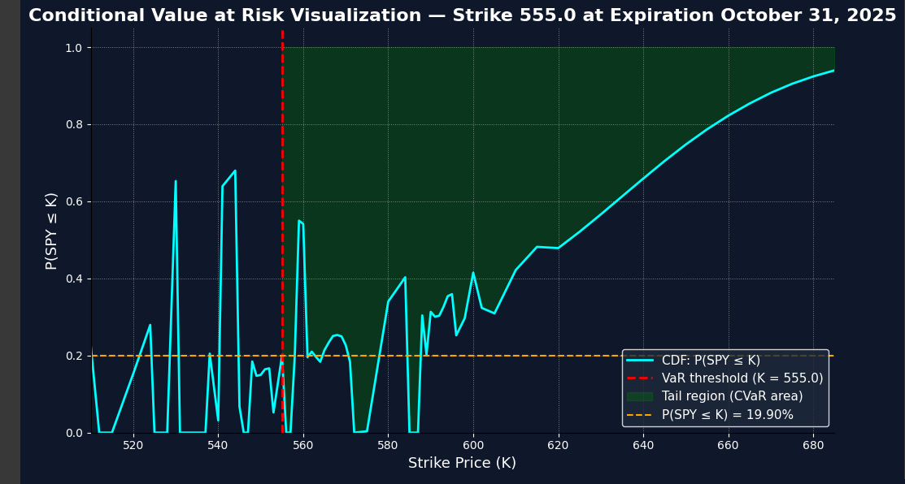
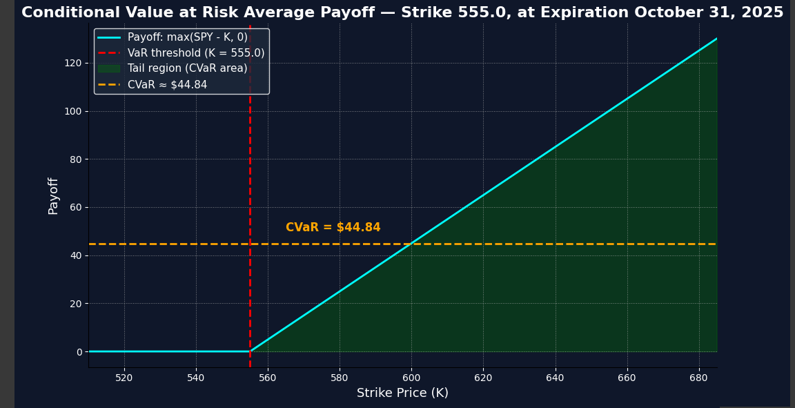

# **Stock Market Risk Analysis Tool (How It Works/Limitations)  📈**

**I built a tool in python that scrapes live options market data for SPY and calculates/creates plots of the risk neutral probabilities and conditional value at risk pay offs for each corresponding strike price and expiration date.**

  

## **What is CVaR?**
CVaR is expected shortfall and is a risk assessment measure. CVaR is derived by taking a weighted average of the losses in the tail of the distribution of possible returns, beyond the value at risk (VaR) cutoff point. It answers the question "If a loss exceeds the VaR threshold, what is the average loss in that worst-case tail?”

My tool uses CVaR upside analysis and answers the question, "“If a gain exceeds the VaR threshold (e.g., SPY ends above a selected strike), what is the average gain conditional on being in that upper set of outcomes?”

For this example, say we choose strike price 555 and expiration date 10/31/2025 for today (code ran in spring 2025)

In the first graph that the code outputs, it shows the CVaR region in green and shows the probabality that SPY will end below strike price (k) 555 at the expiration of October 31, 2025 which is 19.90%. This implies a The blue line traces out the implied cumulative distribution under the risk-neutral measure. It's jagged at some points due to sparse data or noise. The green region is the region for calculating CVaR.

In the second graph that the code outputs, it shows the average payoff conditional on that 19.90% probability. There's a 80.1% that SPY finishes above strike price 555, and the average expected pay off is approximately 44.84 (this is before subtracting the premium paid for the option contract)

## Where do the probabilities come from?

The probabilities come from differentiating option prices with respect to strike which allows us to extract the implied risk neutral distrubtion of SPY at expiration. Options reflect forward looking market expectations of what the market thinks SPY will be worth at expiration under a risk neutral measure. This is the risk neutral distribution embedded in option prices. 

The risk neutral distribution is embedded in options due to no-arb pricing theory that assumes all assets grow at risk free rate when discounting under risk neutral measure. From there, you can back out cumulative probabilites from observed option prices. In practice, you'd use real world measure; however risk neutral measure is a good proxy for shorter time frames. The difference between risk neutral and real world diminishes as time approaches 0 (shorter time frames). Under real world probabilities, CVaR is lower than under risk neutral probabilities. 

The methodology comes from Giovanni Barone Adesi papers which uses European put option to extract the implied risk neutral distribution of asset prices at expiration. I take this methodology and use American call options to extract these distributions. Most models require assumptions about the distribution of returns, but here we directly extract this distribution based on forward looking expectations of the market embedded in option pricing.

## Hows it different from delta?

Delta gives a pointwise slope with respect to price, while f(K) gives the full risk-neutral probability density over strikes, which is essential to integrate and compute expected losses or gains.This allows you to look across multiple outcomes, weighted by their likelihood. 
