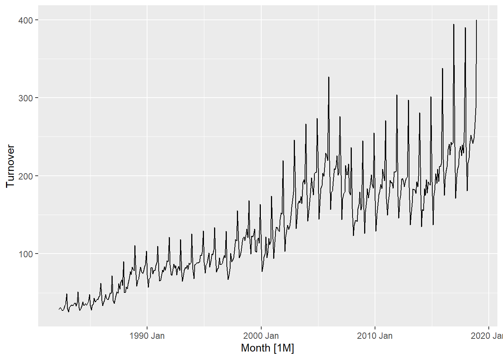
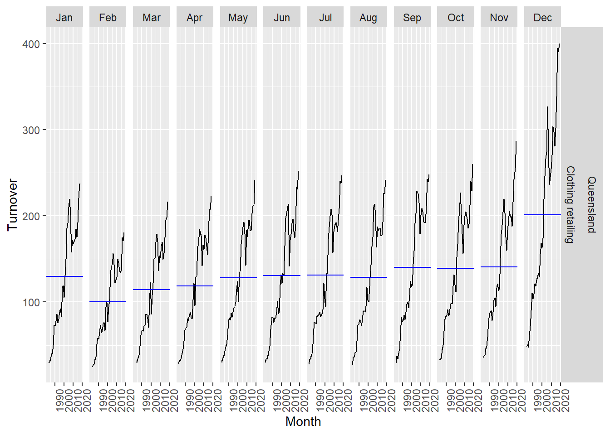
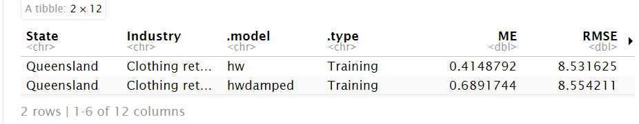
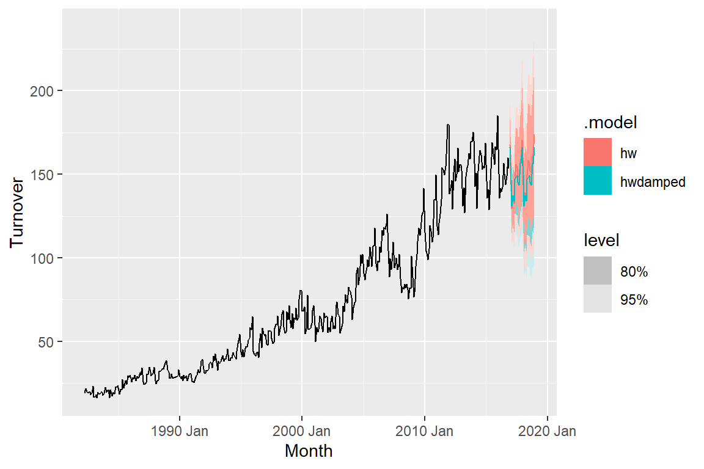

# **Retail Sales Prediction Time Series Project 🛍️📈**

## **Question: Which time series model best predicts retail sales in Queensland, Australia?**

## Method:

**Dataset Information:**

**State**: The Australian state/territory (Australlian capital, New South Wales, Northern Territory, Queensland, Southern Australia, Tasmania, Victoria, Western Australia.

**Industry**:	The industry of retail trade (cafes, takeout, pharmaceutical, clothing, newspaper/book, household goods, hardware, furniture, dept stores, liqor, footwear, electronic goods) is included in the dataset. 

From the dataset, we selected the **Queensland State** and the **clothing industry** due to personal interest. The model focus will be **Exponential Trend Smoothing** models.

## Part 1 Data Visualization

The first plot is a basic time series plot showing retail sales in Queensland for clothing from 1982 to 2020. Two **key features** we are looking for are **trend and seasonality.** There is a clear upward trend, and there are regular repeating peaks approx every 12 months indicating strong yearly seasonality. The seasonality appears multiplicative. 

Second plot shows retail sales in Queensland separated by year and month. 2011 and onwards sees the highest sales with the highest sales month being December.

Third plot dives deeper into month and shows detailed variations between each month with February as the lowest sales month. 

**Autocorrelation** plots show auto correlation (temporal dependence) between time periods meaning past values influence future values. The autocorrelation plot shows **extremely strong temporal dependence** which makes sense as we observed a trend and seasonality from the first plot. Having trends mean there is a long term correlation across observations while having seasonality means there is cyclical time dependence. 

**To create a model that can forecast, we need models that capture trend/seasonality so the autocorrelation plots show minimal temporal dependence (not seen right now).** Another way is to difference the data to coerce stationary (meaning constant mean/variance over time). 

## Part 2 Model Selection and Creating Potential Forecasts

Based on the graphs above, **an Exponential Trend Smoothing (ETS) model** would be appropriate due to the trend and multiplicative seasonality present. Exponential smoothing is a method of forecasting that uses a weighted average of past observations to predict future values. The weights assigned to past observations are exponential, with more recent observations having a higher weight than older observations ETS models incorporate error (additive or multiplicative), trend (none, additive, or damped), and seasonality (none, additive or multiplicative). This means there are about **18 possible ETS models** we can choose from.

I am choosing **ETS (M,A,M) and damped ETS model (M,Ad,M)** based on the graph as it shows multiplicative seasonality, matched seasonality with residuals and trend is visible as well.

The **difference between the models** lies in the trend, where ETS (M,A,M) assumes an aggressive trend over time while ETS model (M,Ad,M) assumes a dampening trend over time.

**hw = ETS(M,A,M)
hwdamped = ETS(M,Ad,M)**

We see from the graph that hw forecasts are more aggressive than hwdamped. Next, we want to assess the accuracy of the fitted values to the observed values

## Part 3 Accuracy of Fitted to Observed Values

The RMSE’s are pretty similar with the hw model having a slightly lower RMSE. However, this is **not a true measure of forecast performance**, this only assesses how well the model explains the already observed data. **What's needed is to compute true out-of-sample forecast accuracy by comparing predicted values to data the model has not seen.** This will show how the model will work with **unseen data,** which is what’s important for **creating predictions.**

## Part 4 Accuracy of Training to Test Data

This graph demonstrates what we needed to do to **address measuring forecast accuracy on new unseen data.** We split the dataset into **training (blue)** and the **test data (red)** that will be forecasted. All observations **before 2016 Dec are training data** and **everything after 2016 Dec is test data.** In other words, the model will use the training data to try to predict the test data and compare it to the actual observed values and see how accurate it is.

**Note how the hw damped model now has a lower RMSE than the hw model. Though the hw model was able to reproduce the same training data better, it failed in predictive ability of future test values compared to hw model which is why it was essential to run this test. However this only gives us a snapshot of one time period**

These are the forecasts for the final 2 years based on the training dataset. Second graph is zoomed in on the fprecasted data.

## Part 5 Cross Validation

A large **limitation** to the above analysis is that one train-test split only gives us **one snapshot for one time period**. It **does not** reflect how the model will perform in **different time periods** or in different conditions. To **address this problem**, **cross-validation is necessary**.

Specifically, rolling window cross-validation will train the model on increasing windows and then test on the next 3 months and evaluate performance over each time. Then repeats.

**Important note: I added auto ARIMA model and SNAIVE to the cross-validation. SNAIVE is a simplified time series benchmark model we’re using to compare to make sure we’re actually improving forecast accuracy. ARIMA is another common time series model. So now we are comparing 4 models' predictive abilities.**

More info on what the code is doing: 
First iteration: 1–36 observations then test the model on next 3 observations.
Second iteration: 4–39 observations, forecast 40, 41, 42.
Third iteration: 7–42, forecast 43, 44, 45. 
and so on....

**Iterations** = (total observations - initial training size) / step size
= (31995 - 36) / 3 = 10653

**Total number of iterations** = iterations for rolling window (fold) × number of models
= 10653 × 4 = **42,612**

~42,612 total iterations mean it will take some time to run.

**Based on the cross-validation results, hw model ETS(M,A,M) has the lowest RMSE meaning it had the most accurate forecasts on average across all forecast horizons compared to other models.**

## Final Check

**Before**

**After**

We want to check the autocorrelation from before vs now. If the lines are all between the blue bounds, it means there is **no significant autocorrelation remaining** in the residuals meaning the model has **successfully** captured time-dependent structure in the data. There is still **some** temporal dependence at lag (time) 4 and 12 meaning that the model is not perfect but it did capture a significant amount of the structure comparing the autocorrelation plots from before vs after.

## Conclusion

We can identify the best performing models by comparing their RMSE values. In Parts 1–3, we analyzed the data to devise potential time series models and assessed their in-sample accuracy by comparing the fitted values to the actual observations. In Part 4, we split the data into training (before December 2016) and testing (after) to evaluate how well each model forecasts **a single future period.** In Part 5, we extended this evaluation by using approximately 40,000 rolling windows, repeatedly training and testing across **all future time periods.** This provided a more robust assessment of predictive performance, ultimately resulting in the **hw model (ETS(M,A,M))** as the most accurate overall.

Source and Credits:
Australian Bureau of Statistics, Catalogue Number 8501.0, Table 11.

Credits to https://otexts.com/fpp3/

