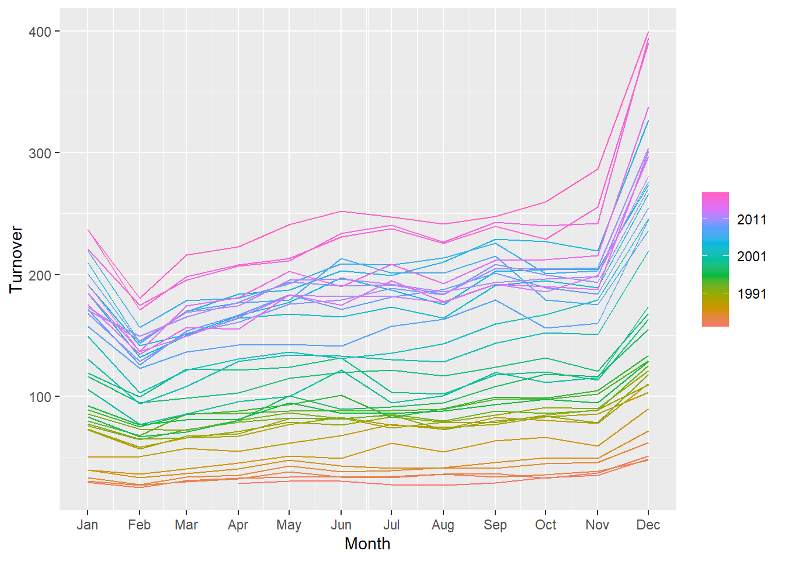
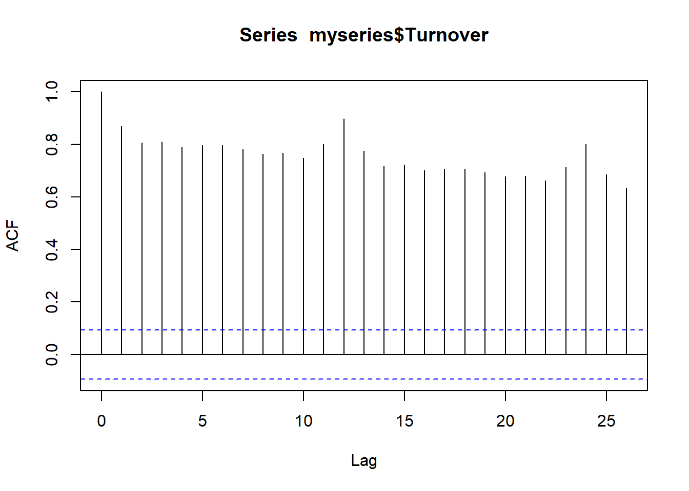
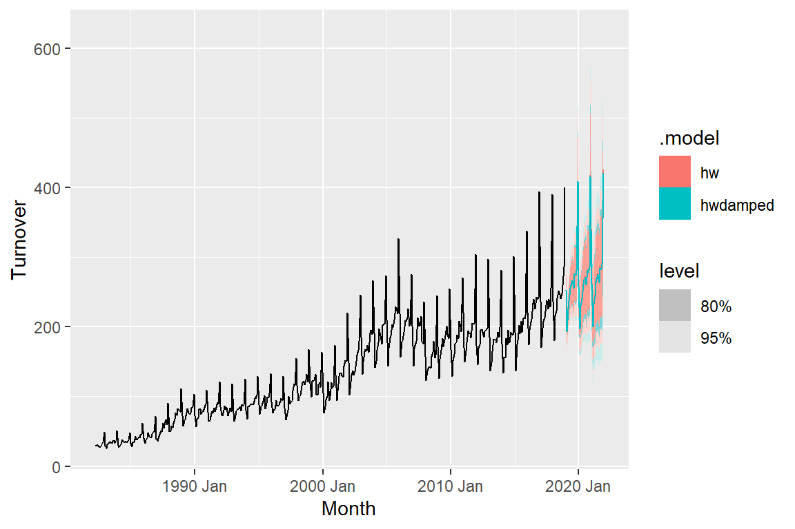

# Retail Sales Prediction Time Series Project

Question: Which time series model best predicts retail sales in Queensland, Australia?

Method:

Dataset Information:

State: The Australian state/territory (Australlian capital, New South Wales, Northern Territory, Queensland, Southern Australia, Tasmania, Victoria, Western Australia.

Industry:	The industry of retail trade (cafes, takeout, pharmaceutical, clothing, newspaper/book, household goods, hardware, furniture, dept stores, liqor, footwear, electronic goods) is included in the dataset. 

From the dataset, we selected the state Queensland and the clothing industry due to personal interest. 

## Data Inspection

The first plot is a basic time series plot showing retail sales in Queensland for clothing from 1982 to 2020. Two key features we are looking for is trend and seasonality. There is a clear upward trend, and there are regular repeating peaks approx every 12 months indicating strong yearly seasonality. The seasonality appears multiplicative. 

Second plot shows retail sales in Queensland separated by year and month. 2011 and onwards sees the highest sales with the highest sales month being December.

Third plot dives deeper into month and shows detailed variations between each month with February as the lowest sales month. 

The autocorrelation plot shows extremely strong temporal dependence which makes sense as we observed a trend and seasonality from the first plot. ACF plots show auto correlation (temporal dependence) meaning past values influence future values. Having trends mean there is a long term correlation across observations while having seasonality means there is cyclical time dependence. 

To create a model that can forecast, we need models that capture trend/seasonality so the autocorrelation plots show minimal temporal dependence (not seen right now). Another way is to difference the data to coerce stationary (meaning constant mean/variance over time). 

placeholder

placeholder

