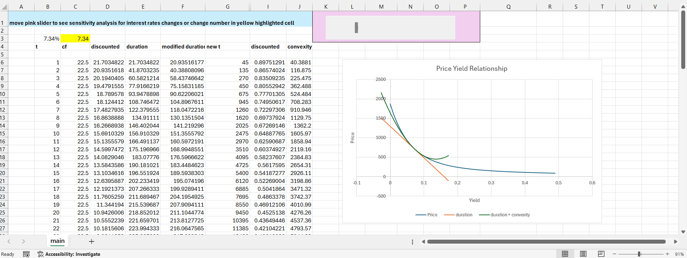

Bond issued by Apple with CUSIP: 037833AT7, maturity in 5/6/2044

**Duration** is a **linear approximation** of the bond’s price sensitivity to interest rate changes, calculated by taking the first derivative of the bond's price with respect to yield. However, the relationship between price and yield is not linear; it is a **convex** shape. The duration linear approximation will always **overstate** decreases in bond prices when rates increase, and always **understate** increases in bond prices when interest rates fall. Because of this, the linear approximation **only** works well for **small changes** in interest rates, since the gap between the price/yield relationship and duration is small. For **large changes** in interest rates, you need to account for **convexity** (the curvature) of the price/yield relationship to get a **better approximation** of the bond's price sensitivity. This is done by taking the second derivative of the bond's price with respect to the yield. Convexity is a benefit to bondholders as it means bond prices fall less and rise more than a straight line would suggest. 

**The excel file below graphs the price/yield relationship of an Apple security maturing in 5/6/2044. Moving the **pink slider** displays a **sensitivity analysis** for rising and falling interest rates at different rates**, showing the corresponding duration, convexity, and price movement on the graph. This gives a better understanding on how bond prices react to interest rate changes, and how duration and convexity together provide a more accurate estimate of price sensitivity, especially for larger interest rate movements.

<a href="https://aaishahaslam.github.io/projects/project4/Apple project.xlsx" download>Download Excel File Here</a>

