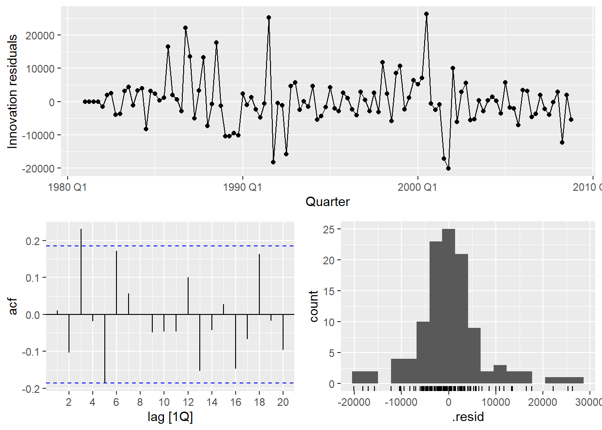

# **US Flight Arrivals Forecasting ✈️**

## **Question: Time series model that can better predict international flight arrivals from the US**

## Background

This project is an extension of the Retail Sales Prediction project except instead of ETS models, we're comparing an **automated ARIMA and a manually selected ARIMA**. ARIMA models are **AutoRegressive Integrated Moving Average** models that forecast values based on its own past values and past errors. The **AutoRegressive** (AR) component uses lagged past values to predict the present. The **Integrated** (D) component applies differencing to make the data stationary. The **Moving Average** (MA) component models past forecast errors. 

p= AR, d= differencing, q = MA

**These models are parameterized as **ARIMA(p,d,q)(P,D,Q)[s],** where the lowercase letters represent **non-seasonal** components and the uppercase letters represent **seasonal components** with seasonality period **s**.**

**The models we are comparing are an automatically generated ARIMA from R software and an ARIMA ordering we manually chose based on observing autocorrelation and partial autocorrelation plots.**

## Dataset Information

Quarterly international arrivals to Australia from Japan, New Zealand, UK and the US. 1981Q1 - 2012Q3. We are focusing on **US international flights.**

## Differencing and Model Selection

The first plot is a basic time series plot showing US flight Arrivals from 1981 to 2012. Features we are looking for are trend and seasonality. There is a clear trend, and the seasonality seems to occur over a few quarters which makes sense in context as different quarters have fluctuating travel volumes.

Since there is trend and seasonality present, we want to **difference** the data to make it **stationary.** Stationary means there is a constant mean and variance over time. **Making the data stationary will allow us to effectively look at the autocorrelation and partial autocorrelation plots and devise an appropriate ARIMA model by helping us identify the AR and MA parameters for the ARIMA model.** The differenced data is shown above.

This is an estimation but from looking at the **autocorrelation** (ACF) plot, we can see the lines are tailing off while from **partial autocorrelation** (PACF) plot, the lines cut off after lag 2 suggesting an AR 2 process. For the non seasonal portion, we get (2,1,0), with 1 non seasonal difference. Looking at the seasonal lags (lags 4,8,12... for quarterly data), we see a spike at lags 1 for both the ACF and PACF plot, meaning 1 seasonal AR and 1 seasonal MA process (1,1,1) with a seasonal difference. 

**The final manually chosen ARIMA model would be (2,1,0)(1,1,1) [4] (4 = quarterly data).**

For the automated selected ARIMA using R algorithms, after fitting the model on the training data, we get an ARIMA order of (1,0,1)(0,1,2) [4] meaning non seasonal AR 1 and MA 1 and seasonal MA 2. These are the two models we'll be comparing.
**The auto generated ARIMA model would be (1,0,1)(0,1,2) [4]**

## Train/Test Data

This is the training/test data split. **Training** data (blue) will be data before Q4 2008 while **testing** data (red) will be 2009 Q1 and afterwards. The models will use the training data and try to predict the test data and the **RMSE** will be used to compare the **accuracy** of the fitted data to the observed data.

## Forecast Comparisons

The first RMSE's above shows how well the model fits the training data. We see that our manually chosen ARIMA is doing slightly better than the automated ARIMA based on the **low** RMSE value.

The second RMSE's show how well the model forecasts unseen future data (15 quarters ahead) and compares it to the actual observed data. We see our manually selected ARIMA again is performing much better than the automated ARIMA. This is suggesting **superior generalization to unseen data for the manual ARIMA model**. This is for a single time period however, later we'll use cross validation to see performance against various time periods.

These are the forecasts for the next 15 quarters generated by each model. The black line represents the actual observed values, while the blue line shows the SNaive forecasts a **baseline model** that assumes future values will repeat the past seasonal pattern. If a model cannot **outperform** SNaive, it may **not offer** meaningful predictive value. From the plot, we can see that the automated ARIMA model deviates significantly from the actual data, while our manually selected ARIMA model aligns more closely. This suggests that manual ARIMA selection, guided by diagnostic plots, currently yields better performance.

This is a zoomed out version of the previous graph.

## Cross Validation 

The table summarizes the **average forecast accuracy of each model** (ARIMA_auto, ARIMA_manual, and SNaive) across all rolling-origin **cross-validation folds.** A lower RMSE indicates better performance. The code performs rolling-origin cross-validation by first creating a series of expanding training windows using starting with the first 40 observations and incrementally adding one observation at a time. For each window, it fits three forecasting models—an automatic ARIMA, a manual ARIMA, and a seasonal naïve model—using only the data available up to that point. It then generates forecasts **15 quarters ahead** from each model and the forecasts are compared against the actual values from the original dataset to calculate accuracy metrics such as RMSE. This rolling-origin cross-validation process results in 73 windows. In each window, three models are fit—an automatic ARIMA, a manual ARIMA, and a seasonal naïve model, leading to a total of 219 model fits and 3,285 forecasted values across all models.

Most of the lines in the ACF plot are between the blue bounds meaning there is **no significant autocorrelation** remaining, so the model has sucessfully captured the **majority** of time dependent structure in the data.

## Conclusion

Our manually chosen ARIMA model **continuously outperformed** the automated ARIMA and SNaive benchmarks. This implies that using automated arimas alone is not sufficient and could result in less-than-ideal projections, particularly when domain expertise or thorough diagnostic analysis can guide better model selections. 

Source:
Tourism Research

credits to https://otexts.com/fpp3/ and https://link.springer.com/book/10.1007/978-3-031-70584-7

